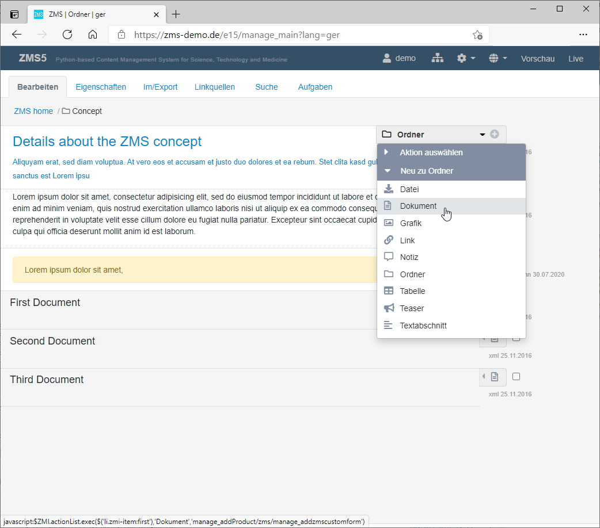
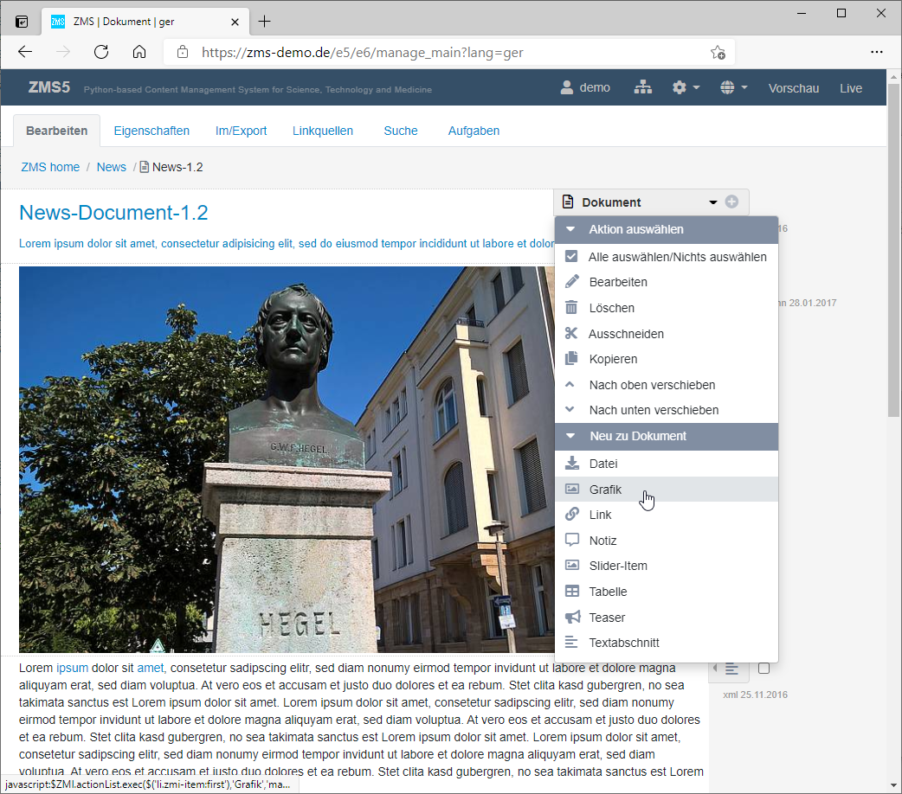
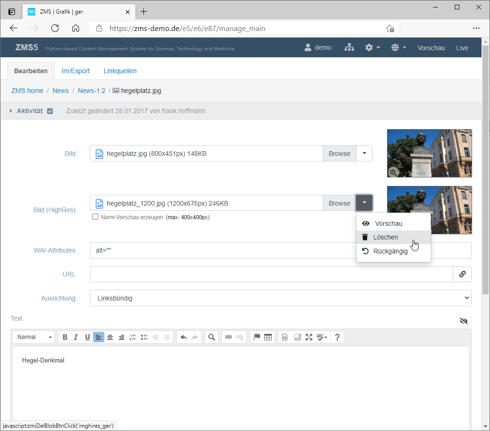

# Für Redakteure: Content Produktion

## Einleitung
Das grafische User-Interface (GUI) von ZMS ist fokussiert auf die redaktionelle Inhalte-Produktion. Um einen gestaltungs-neutralen Content-Strom zu erzeugen, produziert die Redakteurin eine Folge von Content-Blöcken; ein Block kann ein Link, ein Bild, ein Video or eine andere Content-Klasse sein, die im System konfiguriert ist und im rechtsseitige Aufklapp-Menu ("Kontext-Menü") gelistet ist.
Ein Content-Block wird hinzugefügt, indem man auf den Namen der Content-Klasse kickt, das anschliessend erscheinende Formular ausfüllt und durch Klick auf den "Speichern"-Button den Vorgang abschliesst.

*Das ZMS-GUI zeigt der Redakteurin eine reduzierte Seitenvorschau, in der alle Content-Blöcke des Seiteninhalts gelistet werden und einzeln zur Berarbeitung ausgewählt werden können. Neue Content-Blöcke werden durch Klick auf den entsprechenden Namen der gewünschten Content-Klasse im rechtseitigen Aufklapp-Menü ergänzt*

## Bildschirms-Layout (ZMS Management Interface, ZMI)

Das ZMI erfüllt zwei grundlegende Funktionen: schnelles Navigieren durch den Inhalt und effizientes Bearbeiten der Inhalt. Für die Navigation werden folgende Elemente angeboten:
1. Obere Leiste (adminstrative Meta-Funktionen)
2. Hauptmenü (Tab-Menu)
3. Pfad-Navigation (Micronavigation)
4. Sitemap (Baum-Navigation)

und für das Bearbeiten:
1. Kontext-Menü (zum Hinzufügen neuer Inhalte und Ausführen von Funktionen)
2. Spezifische Eingabe-Formulare für die struktur-monotone Content-Produktion

## Obere Leiste
Die obere Leiste stellt einige übergreifende Funktionen bereit, die in alle Bearbeitungs-Zusammenhängen relevant sein können:
1. Anzeige des eingeloggten User-Namens mit Link zum eigenen Profils,
2. das Sitemap-Icon schaltet die linksseitige Baum-Navigation an und aus,
3. das Konfigurations-Menü listet Rollen-spezifische administrative und Konfigurations-Funktionen
4. das Flaggen-Icon zeigt die zu produziernden Sprachvarianten an (für den Fall, dass es sich um eine multlinguale Site handelt)
5. das Globus-Icon zeigt die verfügbare GUI-Sprachen an
6. der "Vorschau"-Link wechselt für das aktuelle Dokument in die Webdesign-Ansicht (sog. Drittsicht) 
7. der "Live"-Link wechselt für das aktuelle Dokument auf den Produktiv-Server (falls dieser sich vom Vorschau-Server unterscheidet) 

## Hauptmenü
Das Hauptmenü ("Tab-Menü") befindet sich unter der oberen Leiste und erlaubt den Wechsel unterschiedlicher Bearbeitungs-Modalitäten für den aktuellen Content-Knoten:
1. Bearbeiten: das erste Tab ist die Standard-Ansicht und zeigt eine Folge der Content-Blöcke, aus denen die akktuelle Seite besteht.
2. Eigenschaften: beschreibende Attribute wie Titel, Kurztitel, Beschreibung etc. (sog. Metaattribute)
3. Import/Export: ermöglicht Daten-Im/Export im XML-Format.
4. Linkquellen: listet alle Linkobjekte, die auf den aktuellen Dokument-Knoten zeigen
5. History: falls die Versionierung aktuviert ist, werden die Änderungen im Zeitverlauf dargestellt
5. Suche: Volltext-Suche über den Dokument-Baum
6. Aufgaben: Listet alle Dokument nach ihrem (Workflow-) Status

## Pfad-Navigation 
Die Pfad- oder Micronavigation befindet sich unter dem Hauptmenü und an, in welcher Tiefe sich der aktuelle Dokument-Knoten befindet bzw. ist einer Liste aller übergeordneten Knoten einschliesslich des Einstiegsknotens (sog. "Root").

## Sitemap
Der Klick auf das Sitemap-Icon erzeigt auf der linken Bildschirmseite eine Baum-Navigation, wie man sie einem Datei-Explorer kennt: analog ist der Dokumentbaum ist eine hierarchische Ordnung von Ordnern und Dokumenten. Durch Klick auf einen Ordner- bzw. Dokument-Titel öffnet sich die Hierarchie und man gelangt sehr schnell in das entsprechende Bearbeiten-Menü.

*Sitemap-Navigation zum schnellen Browser durch den Dokument-Baum*

## Kontext-Menü: Content-Objekte anlegen und bearbeiten
Rechts neben dem Inhalt befindet sich neben jedem Content-Block ein Button für das sogenannte Kontext-Menü. Dieses Menü klappt auf Maus-Klick auf zeigt eine Liste möglicher Aktionen (Einfügen, Kopieren, Löschen etc.) sowie eine Liste von Content-Typen, die in den aktuellen Kontext eingefügt werden können.

ZMS hierarchisiert Inhalte in einem Dokumentbaum analog einem Buch, in dem der Inhalt als Folge von geschachtelten Kapiteln organisiert ist. Dieser Baum wird aus seiten-artigen Content-Objekte (Dokument, Ordner; auch "Page", oder "Container" genannt) aufgebaut. Der eigentliche Inhalt einer Seite wird als Serie von Content-Blöcken erzeugt (Textabschnitt, Bild, Teaser, Donwload-Datei). Der Unterschied zwischen den seiten.artigen Objekten, *Dokumenten* und *Ordnern* besteht darin, dass Ordner auch weitere Unterseiten (Ordner und Dokumente) enthalten können, während ein "Dokument" immer das Ende einer Verzeigung im Dokumentbaum darstellt.

*Ein neues Dokument wird in den aktuellen Ordner über das Kontext-Menü eingefügt*

Nachdem via Kontext-Menu ein Content-Typ, z.B. "Dokument" ausgewählt wurde, erscheint eine Maske zur Eingabe der inhaltlichen Eigeschaften (Metadaten, Atribute) für das Dokument:
* Kurztitel (Kurzer, technischer Titel für die Navigation)
* Titel (Redaktioneller Langtitel für den Seitenkörper )
* Beschreibung (Knappe Zusammenfassung des Dokumentinhalts)
* Schlagworte
* Typ
* Name des Autors
 
 

*Wenn ein neues Dokument einfügt wird, sind zunächst alle Dokument-Eigeschaften zuerfassen, zumindest Kurztitel und Titel*
 
 

*Ein neues Bild wird in das aktuelle Dokument über das Kontext-Menü eingefügt*
 
 

*Die Maske für das Bearbeiten eines Bild-Objektes erlaubt das Hochladen eines Bildes in zwei Auflösungen sowie die Erfassung einer Legende (Text), einer URL (mit der das Bild zum Link wird), von WAI-Attribute und die Auswahlliste tzr Ausrichtung des Bildes*
 
 

